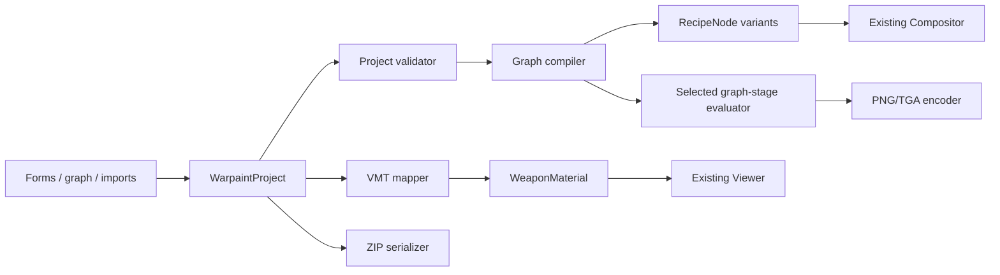

# War Paint Creator Implementation Plan

## 1. Goal

Replace the current `CustomWorkshopModal` mock with a desktop-only creator workspace where someone can build, import, preview, save, and share a War Paint project without editing application code.

The creator will support:

- A labeled, button-driven node graph that compiles into the viewer's existing compositor recipe format.
- Project creation from an operation template, a blank operation, a `proto_defs.vpd` file, or a project ZIP.
- Custom texture, group-mask, sticker, wear, and material assets.
- Sticker placement in both model and UV views.
- Per-project and per-weapon VMT overrides with immediate preview updates.
- Browser-local autosave and a versioned portable ZIP format.
- PNG/TGA export from the final graph output or any selected intermediate node.

The existing catalog/viewer remains the normal landing experience. The creator opens as a full desktop workspace from the stage toolbar. Mobile continues to expose only the viewer.

## 2. Product decisions and boundaries

### Decisions

1. **Use one canonical project model.** Forms, graph nodes, imported proto defs, raw JSON, and ZIP files must all read from and write to the same `WarpaintProject` model.
2. **Compile into the existing renderer.** The graph compiler produces the existing `RecipeNode` tree consumed by `Compositor`; it does not introduce a second compositor.
3. **Keep source data and editor state separate.** Node positions, selection, open panels, and viewport state are editor metadata and must not affect the compiled paint.
4. **Treat VMT support as a supported subset with diagnostics.** Known `VertexLitGeneric` parameters map to `WeaponMaterial`; unknown keys are preserved for round-tripping and reported as unsupported rather than silently discarded.
5. **Keep all work browser-local for the first implementation.** No backend, Steam Workshop submission, direct TF2 installation, or cloud synchronization is in scope.
6. **Make imported content untrusted.** ZIP paths, file sizes, image dimensions, proto block counts, and VMT values require validation before use.
7. **Separate projects from rendered exports.** `.warpaint.zip` stores editable project sources; PNG/TGA export materializes a chosen graph result. Generated images are not silently treated as the project or as a TF2 mod.

### Explicit non-goals for the first complete release

- Executing arbitrary VMT proxies or arbitrary Source shaders.
- Reproducing Valve's Workshop publishing flow.
- Writing directly into a user's TF2 installation.
- Generating a ready-to-install replacement mod in the first release. A later export preset may package files under `materials/patterns/` and `materials/models/`, but this is separate from image export and project ZIPs.
- A mobile creator UI.
- A Photoshop-style raster painting application. The UV view positions existing textures and stickers; it does not replace an image editor.

## 3. Existing capabilities to reuse

| Existing capability | Reuse in creator | Required extension |
| --- | --- | --- |
| `RecipeNode` stage tree | Graph compiler output | Add validation, stable IDs in the editor model, and variant outputs |
| GPU `Compositor` | Live War Paint composition | Accept project asset resolvers and cancel/stale-result handling |
| WebGL render targets | Node/final texture export | Add selected-subgraph evaluation, deterministic readback, color-space conversion, and PNG/TGA encoding |
| `Viewer` weapon loading | Model preview | Raycasting, group inspection, UV-view coordination, and project materials |
| `WeaponMaterial` and `Viewer.applyMaterialParams` | VMT live preview | VMT parser/mapper, supported-key metadata, reset and per-weapon overrides |
| `tools/lib/proto.mjs` | Decode imported `proto_defs.vpd` | Port the buffer/container logic into browser-safe modules |
| `tools/lib/resolve.mjs` | Convert proto definitions into recipes | Refactor shared pure logic or add a browser compiler/decompiler adapter |
| `tools/lib/kv.mjs` | Parse VMT text | Move the pure KeyValues parser into shared TypeScript |
| `tools/lib/vtf.mjs` | Decode imported VTF assets | Replace Node `Buffer` assumptions with `Uint8Array`/`DataView` |
| Existing wear/team/seed controls | Creator preview controls | Move into creator-specific preview toolbar and project state |

## 4. Proposed architecture

### 4.1 Creator project model

Add a versioned model under `src/creator/model/`:

```ts
interface WarpaintProject {
  schemaVersion: number;
  id: string;
  meta: {
    name: string;
    description?: string;
    createdAt: string;
    updatedAt: string;
  };
  kind: 'warpaint' | 'uv-paint';
  operation: OperationSettings;
  graph: CreatorGraph;
  assets: Record<string, ProjectAsset>;
  variants: ProjectVariants;
  weaponSettings: Record<string, WeaponProjectSettings>;
  materialOverrides: Record<string, ProjectMaterialOverride>;
  editor: EditorState;
}
```

Important supporting types:

- `ProjectAsset`: stable ID, role, original filename, normalized path, media type, dimensions, hash, and IndexedDB blob key.
- `CreatorGraph`: versioned nodes, typed ports, edges, and named outputs for RED/BLU and wear variants.
- `OperationSettings`: template ID, team textures, team stickers, randomized stickers, inner wear, exposed albedo, and allowed layer counts.
- `WeaponProjectSettings`: group texture, selected material, per-weapon graph overrides, and UV/sticker placements.
- `ProjectMaterialOverride`: raw VMT text, parsed tree, mapped `WeaponMaterial`, warnings, and unknown-key passthrough.
- `EditorState`: node positions, viewport camera, selected asset/node/weapon, panel sizes, and undo history metadata.

Keep blobs outside the serialized project record. The model references assets by ID so autosave and ZIP export do not repeatedly copy large byte arrays.

### 4.2 State management

- Use a creator-scoped reducer and command layer, not additional top-level state in `App.tsx`.
- Every edit is a command with `do`/`undo` data so graph, sticker, form, and VMT edits share one undo/redo history.
- Separate transient preview state from persisted project state.
- Debounce composition after rapid edits and discard stale composition results.
- Mark project state as `clean`, `dirty`, `saving`, or `invalid` and show it in the workspace header.

### 4.3 Compilation pipeline



Compilation must be a pure function. A project with the same asset IDs, graph, seed, team, wear, and weapon must generate the same recipe and diagnostics.

### 4.4 Proposed source layout

```text
src/
  creator/
    model/              project types, schema migrations, defaults
    state/              reducer, commands, undo/redo, selectors
    graph/              node registry, validation, compiler, decompiler
    operations/         operation templates and setup-to-graph scaffolding
    assets/             import pipeline, asset registry, object URL lifecycle
    storage/            IndexedDB projects and autosave
    packages/           ZIP reader/writer and manifest validation
    export/             graph-result rendering, pixel readback, PNG/TGA encoders
    materials/          VMT mapping, supported parameter definitions
    workspace/          full-screen creator shell and feature panels
  formats/
    keyValues.ts
    protoDefs.ts
    vtf.ts
    tga.ts
  viewer/
    UVViewer.ts
    creatorPicking.ts
```

The current `CustomWorkshopModal` is deleted once the creator shell reaches feature parity with the launcher/close behavior.

## 5. Project archives and rendered exports

These are two independent user actions:

- **Save/Open project** serializes editable sources as `.warpaint.zip`.
- **Export texture** renders a selected graph stage as PNG or TGA.

Keeping them separate prevents a rendered texture from being mistaken for a complete editable project and lets creators export an intermediate result before AO, stickers, wear, or another combination layer is applied.

### 5.1 Portable project ZIP format

Use `.warpaint.zip` as the user-facing filename convention while remaining a normal ZIP archive.

```text
project-name.warpaint.zip
  manifest.json
  project.json
  graph.json
  materials/
    default.vmt
    weapons/<weapon-key>.vmt
  textures/
    patterns/<asset-id>.<ext>
    stickers/<asset-id>.<ext>
    groups/<asset-id>.<ext>
    wear/<asset-id>.<ext>
  imports/
    proto_defs.vpd             optional original source
  preview/
    thumbnail.png              optional
```

`manifest.json` contains the package format version, project ID/name, file table, roles, byte sizes, hashes, and required creator version. `project.json` contains the portable project model without transient editor history or IndexedDB keys.

Import safety rules:

- Reject absolute paths, `..` traversal, duplicate normalized paths, symlinks, and encrypted archives.
- Set configurable limits for archive bytes, expanded bytes, file count, individual file bytes, and image dimensions.
- Sniff file signatures instead of trusting extensions or MIME strings.
- Validate JSON and graph schemas before allocating image or GPU resources.
- Preserve unsupported future fields when safe, but reject unsupported major schema versions.
- Revoke object URLs and dispose GPU textures when projects/assets close or change.

Generated PNG/TGA files are excluded from the project ZIP by default because they can become stale after graph edits. Users may explicitly attach an exported preview or final texture when needed.

### 5.2 Graph-stage texture export

Every graph node that produces a texture can be previewed and exported. The graph context menu and property panel provide **Preview this result** and **Export this result** actions. Output nodes expose the same actions as the obvious final-export path.

Export flow:

1. Compile only the dependency subgraph required by the selected node/output.
2. Evaluate it at the selected weapon, team, wear, seed, and requested dimensions.
3. Read the compositor render target into an RGBA pixel buffer without applying the 3D viewer's lighting or post-processing.
4. Correct WebGL row orientation and convert from the compositor's stored color space exactly once.
5. Encode and download PNG or TGA.

Export options:

- Source node/output and a human-readable filename.
- Weapon, team, wear, and seed context.
- Native weapon composite dimensions, 1024 square, 2048 square, or validated custom dimensions.
- PNG or TGA.
- RGB (24-bit) or RGBA (32-bit) where the format supports it.
- Preserve compositor alpha or force opaque.
- Include/exclude optional graph branches only by selecting the appropriate upstream/downstream node; export must not mutate the graph to simulate this.

TGA export initially writes a standards-compliant uncompressed true-color image with correct origin metadata and 24/32-bit channel order. RLE output can be added after compatibility fixtures prove it is useful. PNG export uses lossless RGBA output.

Acceptance requirements:

- Exporting an intermediate node excludes every downstream layer.
- Exporting the final output matches the texture sent to the weapon material before 3D lighting.
- Re-importing exported PNG/TGA produces the same orientation, dimensions, RGB values, and alpha within the expected 8-bit round-trip.
- Repeated exports release temporary render targets and pixel buffers.

### 5.3 Optional replacement-mod export preset

The discussion also identifies the conventional TF2/SFM replacement locations `materials/patterns/` and `materials/models/`. Because proto defs can reference flexible paths, those directories are a convention rather than a universal project requirement.

A later, explicitly selected **Replacement mod template** export may wrap rendered textures and VMTs in a ZIP using those directories. It must ask which existing War Paint/material paths are being replaced and show the resulting file tree before download. It is not the default `.warpaint.zip` format, and it must not imply that arbitrary custom proto defs can be installed by copying only those two directories.

## 6. Node system specification

### 6.1 Interaction model

- Left node palette with labeled add buttons grouped as **Inputs**, **Masks**, **Blend**, **Stickers**, **Adjustments**, and **Outputs**.
- Every port has a visible name and type. Connections with incompatible types are rejected before they are created.
- Node headers use plain names such as "Pattern Texture", "Select Weapon Groups", "Multiply Layers", and "Apply Sticker"; proto field names appear as secondary technical labels.
- Selecting a node opens its complete labeled property editor in the right panel.
- Graph toolbar provides fit view, validation, auto-layout, duplicate, delete, undo, redo, and raw compiled recipe inspection.
- A visible export button opens the selected-node/final-output export dialog.
- Errors appear both on the affected node and in a navigable diagnostics panel.
- Keyboard and screen-reader actions must exist for adding, connecting, moving, and deleting nodes; the graph cannot be mouse-only.

### 6.2 Initial node registry

| Category | Nodes | Compiles to |
| --- | --- | --- |
| Inputs | Pattern Texture, Wear Texture, Group Mask, Constant Color | `texture_lookup` or generated asset |
| Masks | Select Weapon Groups | `select` |
| Blend | Multiply, Add, Lerp | existing combine node types |
| Sticker | Sticker Variants, Apply Sticker | `apply_sticker` and weighted `StickerDef[]` |
| Adjustments | Levels, UV Transform | `StageTransform` fields on the compiled child/stage |
| Outputs | Preview/Export Output, War Paint Output, RED/BLU Output, Wear Variant Output | named recipe roots or exportable graph stages |

The editor graph may be more expressive than the runtime tree, but the compiler must flatten adjustment nodes into the current `StageTransform` representation.

### 6.3 Validation rules

- No cycles.
- Required inputs connected.
- Correct arity: Lerp has three inputs; sticker application has one surface input; multiply/add have at least two.
- Asset role matches port role.
- Group selection contains valid 0-255 IDs and no more than the compositor's supported selection count.
- Sticker weights are non-negative and have a positive total.
- Output coverage matches enabled team/wear options.
- Referenced assets and per-weapon overrides exist.
- Imported unknown proto stages remain visible as unsupported nodes and block compilation rather than disappearing.

## 7. Phased implementation

### Phase 0 - Remove mock assumptions and lock contracts

**Purpose:** establish the contracts before building another UI.

Tasks:

- Document current recipe, material, texture resolver, and viewer contracts with focused tests.
- Move browser-safe KeyValues and binary helpers out of `tools/` into shared TypeScript modules; keep Node wrappers for extraction scripts.
- Create `WarpaintProject` v1 types, runtime schema validation, defaults, and migration entry point.
- Add representative fixtures: simple texture, group selection, additive/multiplicative combination, weighted stickers, RED/BLU, per-wear, VMT override, malformed proto, malformed ZIP.
- Decide package limits and record them as constants with tests.
- Keep the existing mock accessible only until the creator shell can open/close and load fixtures.

Acceptance:

- A project fixture validates and serializes deterministically.
- Existing real recipes still compose identically in self-tests.
- Node/tool code can share KeyValues and proto structures without importing `fs`, `path`, or Node `Buffer` into the browser bundle.

### Phase 1 - Project store, autosave, and creator shell

**Purpose:** replace the modal with a reliable full-screen editing surface.

Tasks:

- Build the creator reducer, command history, selectors, and dirty/save state.
- Add IndexedDB stores for projects, asset blobs, thumbnails, and schema version metadata.
- Add autosave, manual save, restore-after-refresh, duplicate, rename, and delete flows.
- Create a full-viewport desktop workspace using the existing flat panel/border/blue token system.
- Workspace regions: header, left project/assets rail, center preview/graph area, right properties/diagnostics, bottom status bar.
- Add a start screen with **New War Paint**, **New UV Paint**, **Import proto_defs**, and **Open project ZIP**.
- Add unsaved-change handling on close and before page navigation.
- Remove `CustomWorkshopModal.tsx/.css` after the new shell owns the launcher flow.

Acceptance:

- A blank project survives refresh with all small state restored.
- Undo/redo works across form and graph edits.
- The workspace uses available desktop width/height and remains hidden at the mobile breakpoint.
- Closing a dirty project cannot silently lose changes.

### Phase 2 - Asset import and portable ZIP round-trip

**Purpose:** make projects self-contained without backend storage.

Tasks:

- Implement a central asset import pipeline with drag/drop and file picker entry points.
- Initially accept PNG, JPEG, WebP, VTF, and TGA; normalize decoded images to GPU-loadable URLs while retaining original bytes for export.
- Show dimensions, alpha presence, role, file size, warnings, duplicate hashes, and a thumbnail for every imported asset.
- Support asset roles: pattern, sticker, sticker specular, groups, wear, blood, dirt, normal, exponent, lightwarp, self-illumination mask, and UV base.
- Port VTF decoding to `Uint8Array`/`DataView`; audit supported VTF formats against project fixtures.
- Add TGA decoding with fixtures for uncompressed/RLE, 24/32-bit, origin flags, and alpha.
- Add TGA encoding primitives for uncompressed 24/32-bit output; keep decoding and encoding orientation/channel tests paired.
- Implement ZIP export/import, schema validation, progress UI, cancellation, and conflict handling.
- Perform hashing, ZIP expansion, and large image decoding off the main interaction path where possible.

Acceptance:

- Exporting and re-importing a project preserves graph, materials, assets, and hashes.
- Corrupt, oversized, path-traversing, and version-incompatible archives fail with actionable errors.
- TGA/VTF orientation and alpha match equivalent PNG fixtures.
- Replacing or deleting an asset releases its object URL and GPU resource.

### Phase 3 - Proto-def import and operation templates

**Purpose:** turn existing TF2 operations and custom proto defs into editable projects.

Tasks:

- Port the `proto_defs.vpd` container parser and protobuf decoder to browser-safe code using the existing schema.
- Extract a compact operation-template catalog during the build pipeline: template ID/name, feature flags, texture/sticker counts, combination types, and example paint kits.
- Implement import diagnostics for definitions, operations, item definitions, variables, missing references, and unsupported stage types.
- Add the operation setup step from the concept:
  - Existing template or blank custom operation.
  - Team textures and team stickers.
  - Randomized sticker variants.
  - Inner wear and exposed albedo.
  - Texture/sticker/combination counts and combination method.
- Selecting an existing template shows its capabilities and example paints and initially locks structural fields.
- Selecting a blank operation scaffolds a graph from the requested capabilities.
- Add a decompiler that converts supported imported operations/recipes into labeled creator nodes.
- Preserve raw imported proto objects and unknown fields for diagnostics/round-trip work.

Acceptance:

- Importing a known `proto_defs.vpd` identifies its paintkit operations and creates editable supported graphs.
- Compiling an unchanged imported supported graph produces a recipe structurally equivalent to the extracted recipe fixture.
- Unsupported operations never appear to import successfully; they identify the blocking type and location.

### Phase 4 - Labeled graph editor and live compilation

**Purpose:** deliver the core no-code creation workflow.

Tasks:

- Implement the graph canvas, labeled node palette, typed ports, selection, pan/zoom, minimap/fit, and keyboard controls.
- Implement the initial node registry and schema-driven property panels.
- Build graph validation, diagnostics, and deterministic compilation to `RecipeNode` variants.
- Integrate compilation with the current compositor using the project asset resolver.
- Add compose debouncing, stale-result suppression, an LRU for recent project variants, and visible error/loading status.
- Add a read-only "Compiled recipe" inspector for advanced users.
- Allow any texture-producing node to become the temporary preview root without changing graph connections.
- Add **Export this result** to texture-producing nodes and output nodes.
- Implement deterministic render-target readback plus PNG and TGA download for the selected graph stage.
- Keep texture export independent from screenshots: exported files contain compositor pixels, not the lit 3D viewport.
- Add graph copy/paste and duplication using project-local stable IDs.
- Add undo/redo commands for all graph mutations.

Acceptance:

- A creator can recreate representative multiply, add, lerp, group-select, and sticker fixtures using only labeled controls.
- Invalid edges and cyclic graphs cannot reach the compositor.
- Seed, team, wear, and graph edits update the live preview without reloading the weapon model.
- An upstream node can be exported without downstream AO, stickers, wear, or combination layers.
- Final PNG/TGA export matches the compositor result before viewer lighting and preserves requested alpha.
- Compiler golden tests cover every supported node and representative nested graphs.

### Phase 5 - Texture, weapon-group, and UV workflows

**Purpose:** reproduce the practical authoring flow shown in the concept document.

Tasks:

- Build texture and sticker asset slot panels with select, replace, advanced options, and remove actions.
- Add default/custom blood and dirt textures plus inner-wear texture assignment.
- Add weapon selection with **All weapons** defaults and per-weapon overrides.
- Add group texture selection/import and a group legend.
- Add viewer raycasting that maps a model click to mesh UV and then to the active group-mask value.
- Let an active texture be assigned by clicking a weapon group or by entering group IDs explicitly.
- Implement `UVViewer` to render indexed weapon UV triangles, group overlays, texture preview, pan, and zoom.
- Add a model/UV toggle without destroying the Three.js viewer or losing camera/selection state.
- Implement UV Paint projects as a constrained project kind: one base texture, optional team variants, optional blood/dirt, stickers, selected weapons, and no group-operation graph.

Acceptance:

- Clicking a visible weapon area selects the same group as sampling the corresponding UV/group texture.
- "All weapons" settings apply everywhere until a per-weapon override is created.
- Switching model/UV views preserves the active asset and placement.
- A UV Paint can be created, saved, exported, reopened, and previewed on its selected weapons.

### Phase 6 - Sticker authoring

**Purpose:** make stickers first-class graph and viewport content.

Tasks:

- Add base, team, and randomized sticker variant sets with normalized weights.
- Add sticker advanced options: base/specular textures, level adjustments, team mapping, variant weights, and placement coordinates.
- Add model and UV transform handles for move, resize, and rotate.
- Convert handles into `destTl`, `destTr`, and `destBl` coordinates used by `ApplyStickerNode`.
- Add numeric coordinate fields for precise entry and accessibility.
- Add snap, duplicate, layer order, visibility, lock, and delete controls.
- Define behavior for placements shared across all weapons versus overridden per weapon.

Acceptance:

- Visual and numeric edits stay synchronized and round-trip without coordinate drift.
- Seed changes select weighted variants deterministically.
- RED/BLU sticker variants switch with the team selector.
- Sticker placement produces the same compiled coordinates in model and UV modes.

### Phase 7 - VMT system

**Purpose:** expose material behavior that is currently available only through manual VMT editing.

Tasks:

- Move KeyValues parsing into shared TypeScript and retain comments/raw text where practical.
- Define a supported VMT parameter registry with label, help text, type, default, range, dependency rules, and `WeaponMaterial` mapping.
- Cover the parameters already represented in `WeaponMaterial`: phong, exponent/boost/tint/fresnel, normal map, alpha masks, envmap tint/masks, half-Lambert, rim light, lightwarp, self-illumination, and related texture maps.
- Add missing viewer support only when a parameter can be reproduced accurately and tested.
- Build three synchronized VMT views:
  - Preset selector from extracted in-game materials.
  - Labeled parameter form.
  - Raw VMT editor with parse errors and unsupported-key warnings.
- Support project default VMT plus per-weapon overrides.
- Hot-apply valid changes through `Viewer.applyMaterialParams` without reloading geometry.
- Preserve unknown keys in package export; never execute proxies or includes from imported files.
- Add a compatibility report: supported, approximated, ignored, or blocking.

Acceptance:

- Editing supported VMT parameters changes the current preview immediately and survives ZIP round-trip.
- Known extracted VMT fixtures map to the same `WeaponMaterial` values as the current extraction pipeline.
- Invalid syntax keeps the last valid preview and points to the offending line/key.
- Unsupported shader/proxy behavior is clearly reported and never silently emulated.

### Phase 8 - Hardening, documentation, and release

**Purpose:** make the creator safe and understandable enough for real projects.

Tasks:

- Add a creator self-test suite and headless fixture runner alongside the existing viewer self-test.
- Add keyboard, focus, screen-reader, reduced-motion, zoom, and high-contrast audits.
- Test large projects for memory leaks, object URL leaks, GPU target leaks, and autosave quota failures.
- Add project recovery when the most recent autosave is corrupt or a migration fails.
- Add inline help for operation concepts, node semantics, group IDs, wear, stickers, UVs, and VMT support.
- Add example projects progressing from one texture to multi-layer/sticker/VMT projects.
- Document the ZIP schema and schema migration policy.
- Document the difference between project ZIPs, rendered PNG/TGA textures, screenshots, and the optional future replacement-mod template.
- Add a feature flag during development; make the creator launcher stable only after all release gates pass.

Acceptance:

- Build, lint, existing viewer self-tests, creator unit tests, compiler golden tests, ZIP security tests, and visual checks pass.
- Repeatedly opening, editing, switching weapons, importing, and closing projects does not show sustained memory growth.
- A new user can complete the example project without opening raw JSON, proto defs, or VMT text.

## 8. Testing strategy

### Unit tests

- Project schema validation and every migration.
- Reducer commands and undo/redo inverses.
- Graph validation, topological order, compiler, and imported-graph decompiler.
- Proto container bounds and protobuf decoding.
- KeyValues/VMT parsing and material mapping.
- VTF and TGA decode orientation, channels, alpha, and malformed input.
- PNG/TGA encode/readback orientation, channels, alpha, dimensions, and re-import round-trip.
- ZIP manifest, hash verification, path safety, limits, and round-trip.
- Sticker weight selection and coordinate conversion.

### Integration tests

- Create project -> import assets -> build graph -> compose -> save -> reopen.
- Select intermediate graph node -> export PNG/TGA -> re-import -> compare pixels and metadata.
- Import proto defs -> decompile -> preview -> edit -> ZIP export/import.
- Apply global weapon settings -> create override -> remove override.
- VMT raw/form synchronization and last-valid-preview behavior.
- IndexedDB quota failure and recovery behavior.

### Visual and rendering tests

- Golden compositor fixtures for each node type and nested combinations.
- Model versus UV sticker placement comparison.
- RED/BLU, all wear levels, fixed seeds, and per-weapon material overrides.
- Creator layouts at common desktop widths, browser zoom levels, light/dark themes, and reduced motion.

### Performance checks

- Graph edits must not reload GLB geometry.
- Slider/drag interactions remain responsive while composition is debounced.
- ZIP/image parsing reports progress and can be cancelled.
- Large exports report progress where encoding is not immediate and never retain readback buffers after download.
- Object URLs, imported textures, render targets, and temporary canvases are disposed deterministically.

## 9. Delivery order and dependency gates

1. **Foundation gate:** Phase 0 must finish before UI feature work branches out.
2. **Persistence gate:** Phase 1 must finish before users can create meaningful unsaved work.
3. **Portability gate:** Phase 2 must finish before imported assets become a supported workflow.
4. **Semantic gate:** Phases 3-4 establish operations and compilation before advanced viewport tools.
5. **Authoring gate:** Phases 5-6 deliver texture/group/UV/sticker workflows.
6. **Material gate:** Phase 7 lands after project assets and per-weapon overrides are stable.
7. **Release gate:** Phase 8 is required before removing the feature flag.

Phases 5 and 7 can proceed in parallel after the semantic gate because they touch different renderer seams. Sticker transform work in Phase 6 depends on the UV/picking infrastructure from Phase 5.

## 10. Open product questions

These do not block Phase 0, but must be resolved before their dependent phase begins:

1. Is the optional replacement-mod template needed for the first public release, or should it follow PNG/TGA graph-stage export? This plan places it after the first release.
2. Should imported proto defs expose all 827 known operation templates or a curated, searchable supported subset?
3. Should editing an in-game template automatically fork it into a custom graph, or remain locked until the user explicitly chooses "Customize"?
4. Which VMT keys are required for the first public release beyond those already represented by `WeaponMaterial`?
5. Are sticker placements global by default, per-weapon by default, or chosen when a sticker is created?
6. Should the project package retain original VTF/TGA files, normalized PNG derivatives, or both? The proposed model retains originals and generates transient preview derivatives.
7. Is `proto_defs.vpd` import sufficient, or must the creator also accept the extracted JSON files currently written to `staging/protodefs/`?
8. Does "save" mean browser-local autosave only, immediate ZIP download, or both? This plan assumes both: autosave continuously and export explicitly.
9. Which export defaults should be remembered per project: format, dimensions, alpha mode, and naming template?

## 11. First implementation slice

The first PR-sized vertical slice should prove the architecture without attempting the full editor:

1. Add `WarpaintProject` v1, runtime validation, defaults, and one migration test.
2. Add IndexedDB project/blob persistence with create, autosave, reopen, and delete.
3. Replace the mock modal with the creator shell and start screen.
4. Add PNG import as a project asset.
5. Add three labeled nodes: **Pattern Texture**, **UV Transform**, and **War Paint Output**.
6. Compile that graph into a `texture_lookup` recipe and preview it on the current weapon.
7. Export the output node as PNG using native composite dimensions.
8. Export/import the project as a minimal `.warpaint.zip`.
9. Add one end-to-end fixture covering create -> import -> connect -> preview -> PNG export -> save -> reopen.

This slice validates project ownership, asset resolution, graph compilation, viewer integration, persistence, and package portability before the more complex operation, sticker, UV, proto, and VMT work begins.
