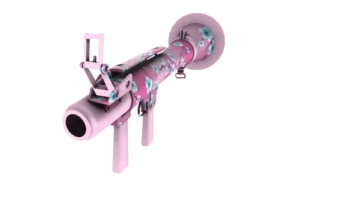

#  TF2 Warpaint Viewer

Preview TF2 war paints in your browser, rendered by a 1:1 recreation of the game's paint compositor and lighting.

<a href="https://rhgx.github.io/warpaint-viewer/?kit=223&weapon=c_rocketlauncher&sheen=hot_rod"></a>

**[Open the viewer](https://rhgx.github.io/warpaint-viewer/)**

## Features

- Browse war paints on every supported weapon, with wear, team, and seed.
- TF2 lighting environments, sheens, unusual effects, and a first-person view.
- Export transparent PNGs and animated turntables (GIF, WebP, APNG, MP4).
- Preview custom war paints from your own definitions and textures.

## Documentation

- [Using the viewer](docs/usage.md): controls, first person, and capture
- [Custom war paints](docs/custom-war-paints.md): importing and exporting paints
- [Development](docs/development.md): scripts, game data, and verification

## Running locally

Requires Node 22+.

```sh
npm install
npm run dev
```

## Support

If you find the viewer useful, you can support it on <a href="https://boosty.to/rhgx/donate"></a> <a href="https://boosty.to/rhgx/donate"><b>Boosty</b></a>.

## Credits

Team Fortress 2 and its weapon models, war paint artwork, textures, effects,
names, and other game assets are the property of Valve Corporation. Parts of
this project are based on the [Source SDK](https://github.com/valvesoftware/source-sdk-2013).
This is an independent community project and is not affiliated with, sponsored
by, or endorsed by Valve Corporation.

## License

The original source code is licensed under the [GNU General Public License v3.0](LICENSE).
It does not apply to Team Fortress 2, the Source SDK, or any Valve-owned assets,
which remain subject to their respective terms and ownership.
